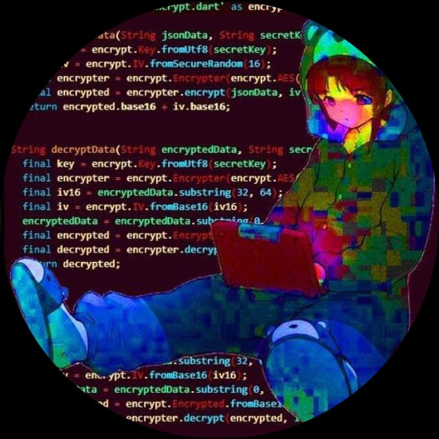

<h1 align="center">Fetch.js</h1>
<h2 align="center">Мы команда разработчиков которые делают то что по душе</h2>

<table>
  <tr>
    <td></td>
    <td></td>
    <td></td>
    <td></td>
    <td></td>
  </tr>
  <tr>
    <td align="center">saivan</td>
    <td align="center">waruk</td>
    <td align="center">yogitomymmc</td>
    <td align="center">alexmotu</td>
    <td align="center">specer</td>
  </tr>
</table>

